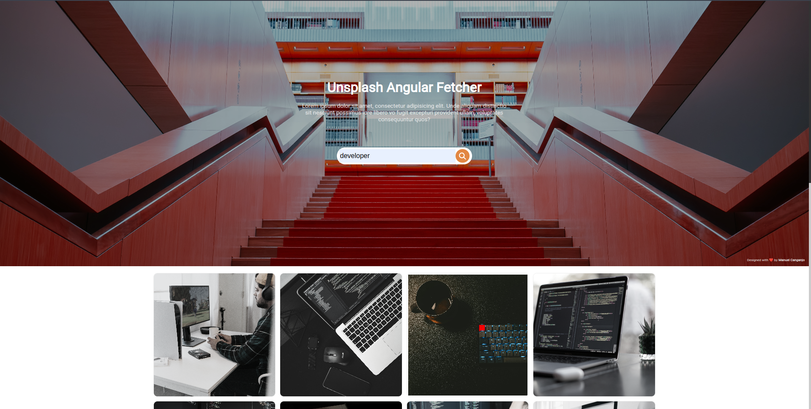

<h1 align="center">
  📸📝 Unsplash Angular
</h1>

An application developed with angular for fetch images from unsplash.

---

## 💼 Tecnologias utilizadas

Para o desenvolvimento deste site utilizei as seguintes tecnologias:
- Angular
- TypeScript
- Sass
- SCSS
- LESS
- FontAwesome

---

<h2>👨‍🚀 Autor</h2>

<table>
  <tr>
    <td>
      <a href="https://github.com/manuelbento19">
         
        
          <b>Manuel Bento</b>
        
      </a>
    </td>
  </tr>
</table>
